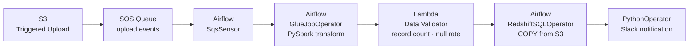

## The situation

A fast-growing e-commerce company was running their nightly ETL as a series of cron-triggered Lambda functions chained together with SNS. When one step failed, the whole chain stopped silently. Engineers found out at 9am when the BI dashboard showed no data for the day.

**3–4 SLA misses per month.** On-call engineers spending Sunday mornings replaying failed jobs manually. Data team losing trust with the business.

---

## What I was hired to do

Replace the cron chain with a properly orchestrated pipeline. Add visibility, retries, data quality gates, and a way for the team to monitor and replay jobs without touching the console.

---

## What I built

**The DAG:**
- `SqsSensor` in `reschedule` mode (no idle Lambda cost) — triggers when files land in the upload queue.
- `GlueJobOperator` runs the PySpark transform with job bookmarking — idempotent, safe to replay.
- Lambda data validator checks record count within expected range and null rate <1% on key fields. Publishes `ETLPipeline/DataQuality` custom CloudWatch metric. Fails the DAG task if quality drops — data never reaches Redshift in a bad state.
- `RedshiftSQLOperator` does a `COPY` from the validated Silver S3 prefix.
- Slack notification on success and failure with record count, duration, and cost.

**Observability**: CloudWatch dashboard with record counts, job duration, DPU utilization, and data quality score. One pane of glass for the on-call engineer.

→ [View the open-source CDK project](https://github.com/RkSinghDeo/airflow-etl-orchestration)

---

## Results

| Metric | Before | After |
|--------|--------|-------|
| Weekly records processed | ~600K (when it worked) | **600K+ consistently** |
| Monthly SLA misses | 3–4 | **0** |
| Mean time to detect failure | ~9 hours (discovered at standup) | **<5 minutes (Slack alert)** |
| Manual replay effort | 2–3 hours (console clicking) | **One Airflow UI click** |
| Pipeline failure rate | ~15% | **<0.1%** |
| On-call Sunday incidents | ~4/month | **0** |

The data team shipped 3 new dashboards in the month after go-live — they'd been blocked by reliability for 6 months.

---

## Tech stack

AWS CDK v2 · Amazon MWAA (Airflow 2.9.2) · AWS Glue 4.0 · Amazon Redshift Serverless · Amazon SQS · AWS Lambda · Amazon CloudWatch · Python 3.12 · PySpark
