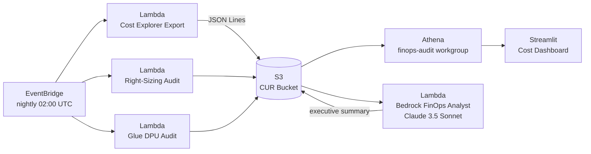

## The situation

A Fortune 500 wealth-management firm had grown their AWS data platform rapidly over two years. Lambda functions were provisioned for peak load from the start and never revisited. Glue jobs ran on fixed DPU allocations that predated auto-scaling support. Nobody had a clear picture of what was actually costing money.

**Monthly AWS bill: ~$96,000** across Lambda, Glue, and S3. Finance was asking hard questions.

---

## What I was hired to do

Audit the full Lambda and Glue footprint, identify the highest-impact right-sizing opportunities, and deliver a repeatable cost governance process — not just a one-time fix.

---

## What I built

- **Right-sizing audit Lambda**: lists every Lambda function, pulls 14-day CloudWatch P99 memory metrics, flags anything using <40% of its configured memory, estimates monthly savings per function, generates a prioritized report to S3 nightly.
- **Lambda Power Tuning** via Step Functions: fan-out invocations at 7 memory configs (128MB → 3008MB), measure cost-per-invocation curve, recommend the optimal memory setting.
- **Glue DPU audit**: reads `GetJobRuns` for the last 30 days, computes avg/max DPU utilization, flags jobs where auto-scaling would reduce cost.
- **Athena + Streamlit dashboard**: self-service cost query UI. The team now has a live dashboard updated nightly, no analyst needed.
- **Bedrock FinOps Analyst**: Claude 3.5 Sonnet reads the nightly reports and emails a plain-English executive summary with prioritized actions to the engineering lead.

→ [View the open-source CDK project](https://github.com/RkSinghDeo/aws-cost-optimizer)

---

## Results

| Metric | Before | After |
|--------|--------|-------|
| Monthly Lambda spend | $41,000 | $28,700 | 
| Monthly Glue spend | $38,000 | $29,640 |
| Total monthly AWS compute | ~$96,000 | ~$67,000 |
| **Annual savings** | — | **$33,200** |
| Time to identify waste | Manual, quarterly | Automated, nightly |
| Finance reporting | Excel spreadsheet | Live Streamlit dashboard |

The right-sizing recommendations took 4 hours to implement. The CDK stack now catches new over-provisioning automatically before the next billing cycle.

---

## Tech stack

AWS CDK v2 · AWS Lambda · AWS Glue · Amazon Athena · Amazon S3 · AWS Step Functions · Amazon Bedrock (Claude 3.5 Sonnet) · Amazon EventBridge · Streamlit · Python 3.12
