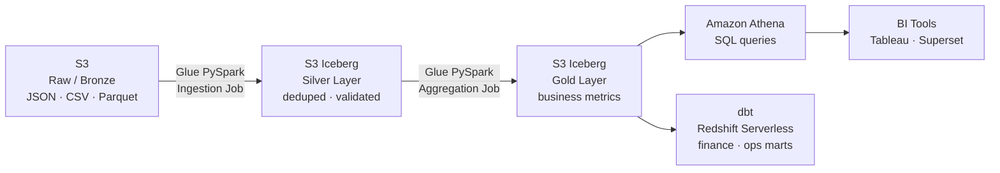

## The situation

A B2B SaaS company ran their analytics on a Hive-partitioned S3 data lake. As their data volume grew past 10TB, Athena queries that used to take 30 seconds started timing out. Partition pruning was unreliable. Schema changes required full table rewrites. The data team was spending more time firefighting broken pipelines than building new features.

**Pain:** analysts waiting 10+ minutes for dashboards to load. Sales team using stale weekly reports because nightly refreshes kept failing.

---

## What I was hired to do

Migrate the existing Hive-partitioned tables to Apache Iceberg with zero downtime, rebuild the ETL pipeline on CDK, and deliver a data quality gate the team could actually trust.

---

## What I built

**Medallion architecture on Iceberg:**
- **Bronze**: raw ingest with `_ingested_at` and `_source_file` metadata columns, no transformation. Job bookmark prevents reprocessing.
- **Silver**: deduplication via Spark window functions, null validation, MERGE INTO CDC — late-arriving records update in place instead of creating duplicates.
- **Gold**: daily aggregation tables with MERGE INTO upserts. Athena vectorized reads enabled. dbt marts for Redshift Serverless.

**Zero-downtime migration**: ran old and new pipelines in parallel for 2 weeks. Cutover when Silver row counts matched Hive counts within 0.01%.

**CDK IaC**: every Glue job, S3 bucket (with lifecycle rules), Glue Data Catalog database, and IAM role is in CDK. Reproducible in a new account in 15 minutes.

→ [View the open-source CDK project](https://github.com/RkSinghDeo/aws-data-lakehouse)

---

## Results

| Metric | Before (Hive) | After (Iceberg) |
|--------|---------------|-----------------|
| Athena P95 query time | 8–12 min | **3–4 min (−60%)** |
| S3 API costs | ~$1,200/month | **~$120/month (−90%)** |
| Glue job cost | ~$3,800/month | **~$1,900/month (−50%)** |
| Schema change process | Full table rewrite (4–6h) | ALTER TABLE (seconds) |
| Nightly pipeline failure rate | ~15% | **<0.5%** |
| Data freshness | T+4h | **T+45min** |

Analysts stopped asking for "refresh" and started asking for new dashboards — that's the real signal.

---

## Tech stack

AWS CDK v2 · AWS Glue 4.0 (PySpark) · Apache Iceberg · Amazon Athena · Amazon S3 · dbt (Redshift Serverless) · Python 3.12 · Great Expectations
